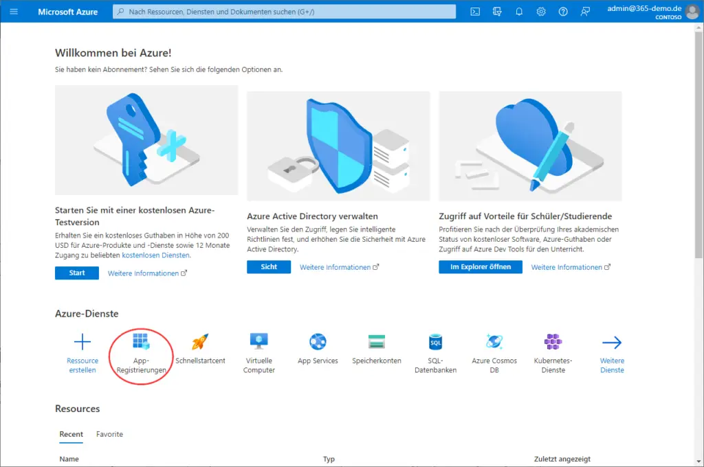
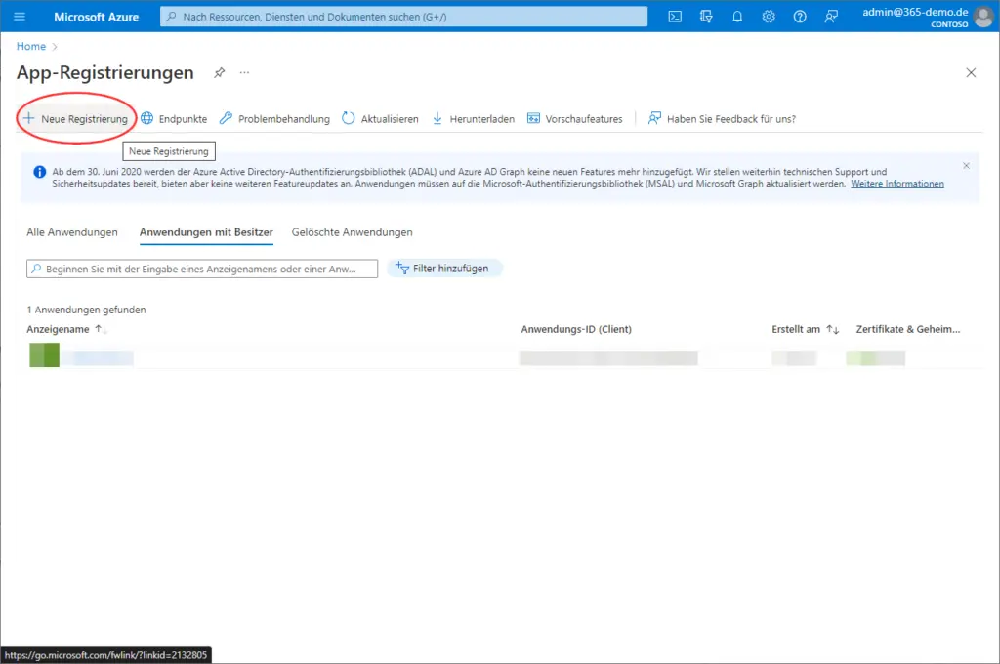
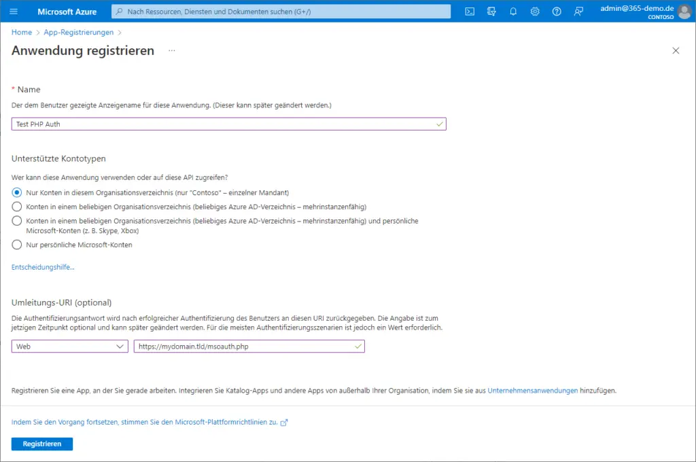
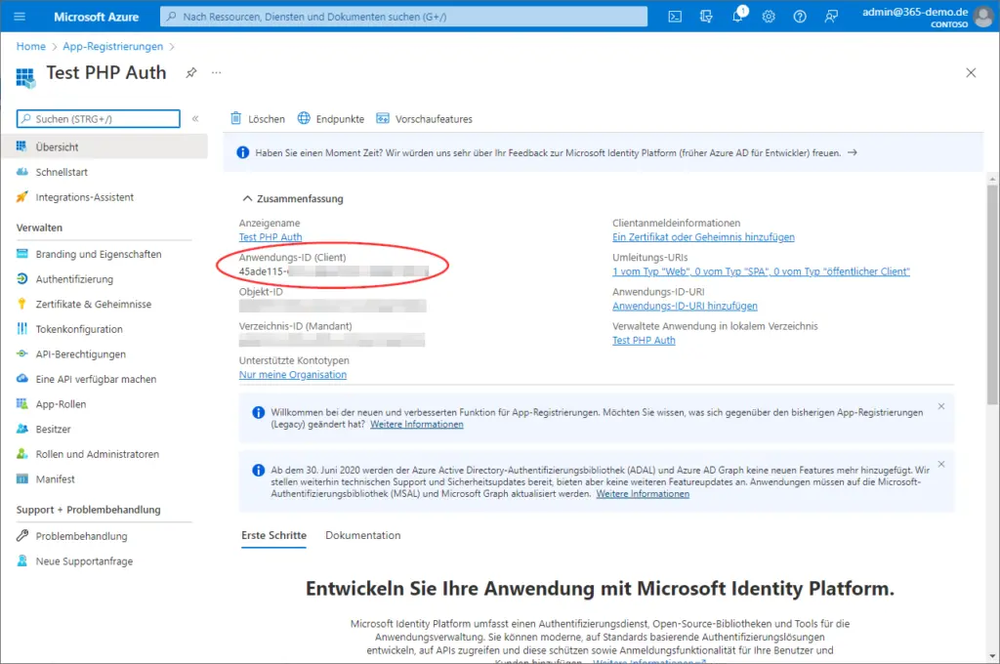
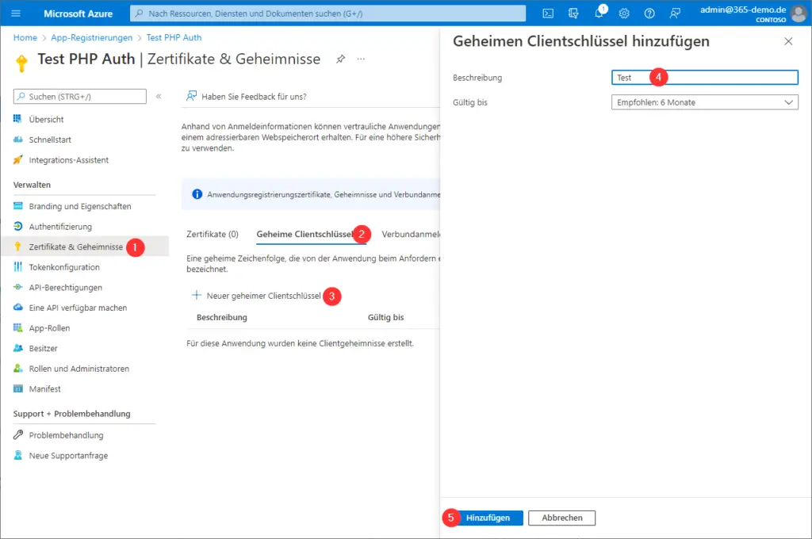
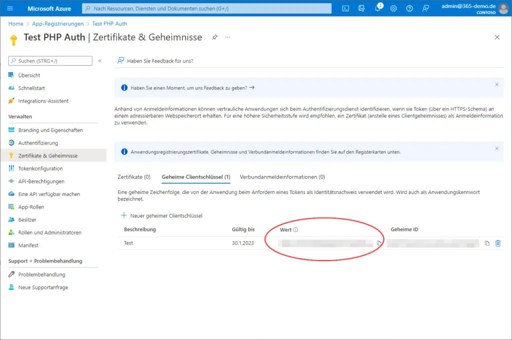

# Setup

## Setup details

https://www.adminlabs.de/anmeldung-mit-microsoft-azuread-php-anwendung/

| [](./assets/01.webp) | [](./assets/02.webp) | [](./assets/03.webp) |
|---------------------------------------------|---------------------------------------------|---------------------------------------------|
| [](./assets/04.webp) | [](./assets/05.webp) | [](./assets/06.webp) |

## PHP-DI:

```php
return [
    /* ... */
    EntraIDEndpoints::class => autowire()
        ->constructorParameter('authorizationEndpoint', 'https://login.microsoftonline.com/<id>/oauth2/v2.0/authorize')
        ->constructorParameter('tokenEndpoint', 'https://login.microsoftonline.com/<id>/oauth2/v2.0/token'),
    
    EntraIDAuthFactory::class => autowire(EntraIDAuthFactory::class)
        ->constructorParameter('landingPageUri', 'https://<host>/entra-id-login.html'),
    
    EntryIDAuthClient::class => factory(function (EntraIDAuthFactory $factory, Container $container) {
        /** @var string $clientId */
        $clientId = $container->get('microsoft.entra-id.client-id');
    
        /** @var string $clientSecret */
        $clientSecret = $container->get('microsoft.entra-id.client-secret');
    
        return $factory->createAuthClient($clientId, $clientSecret);
    }),
    /* ... */
];
```